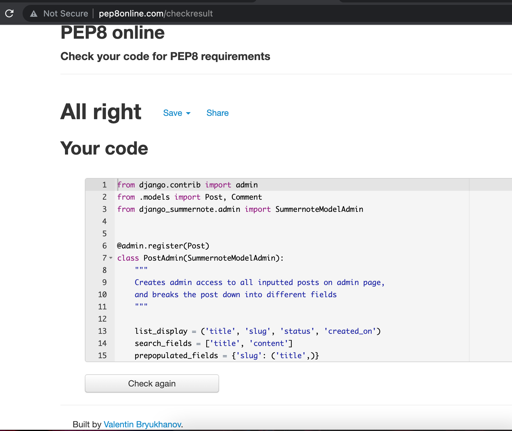
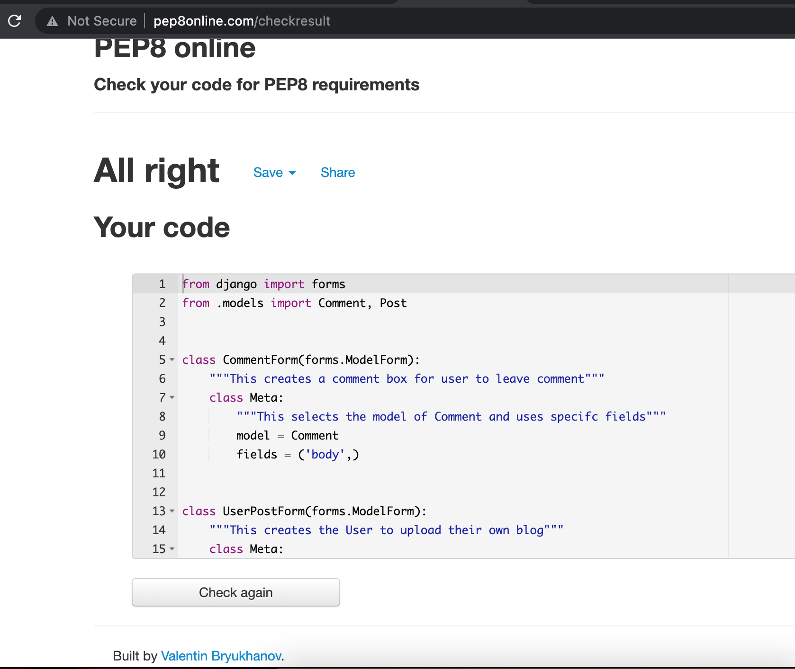
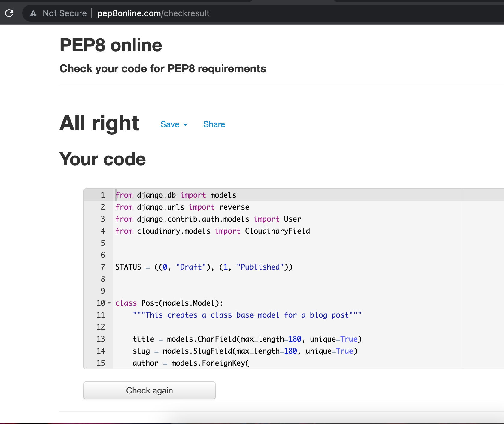
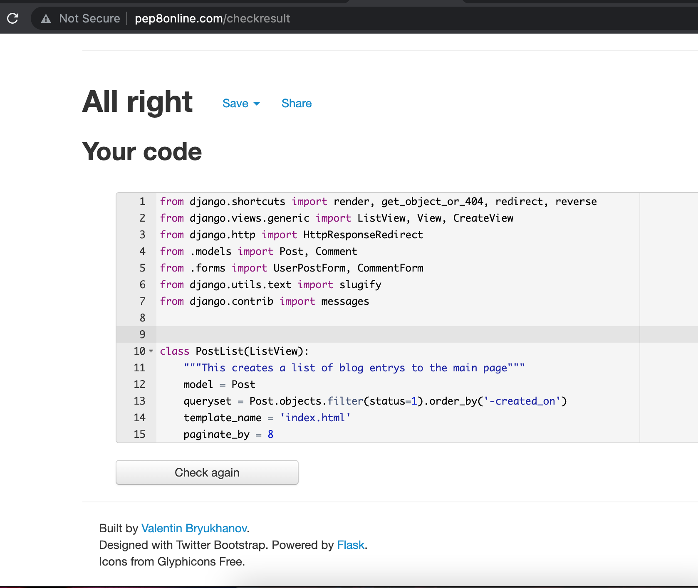
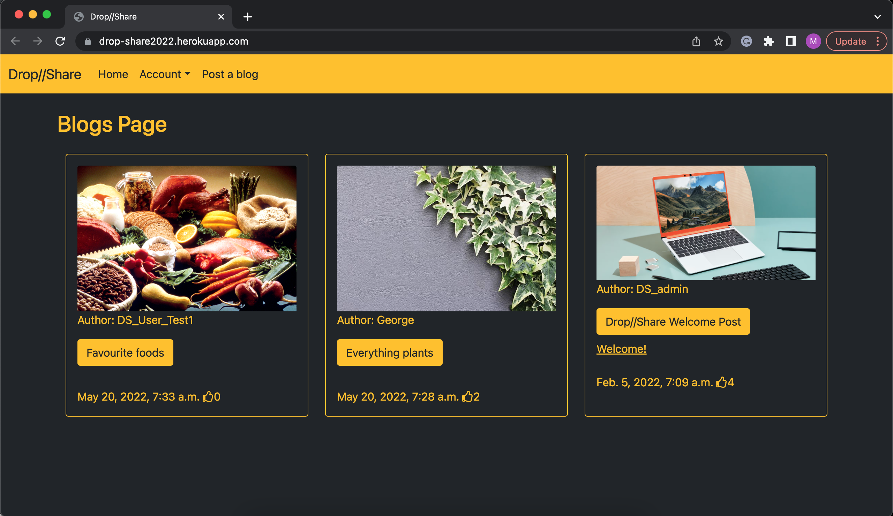
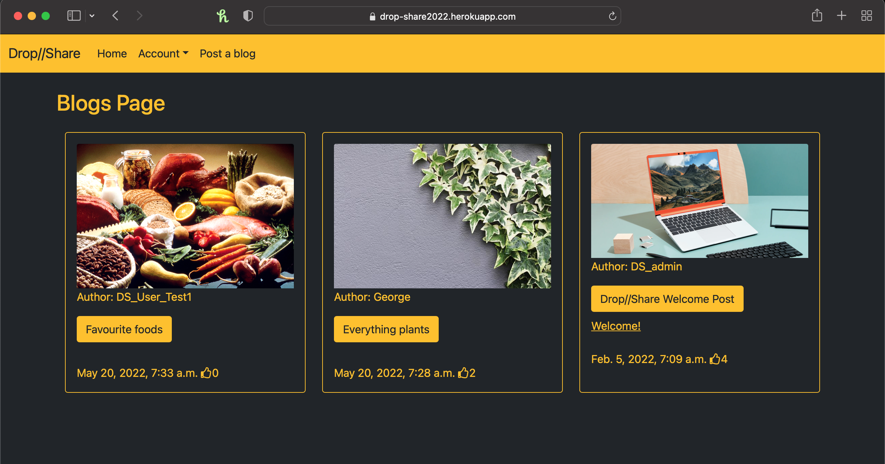
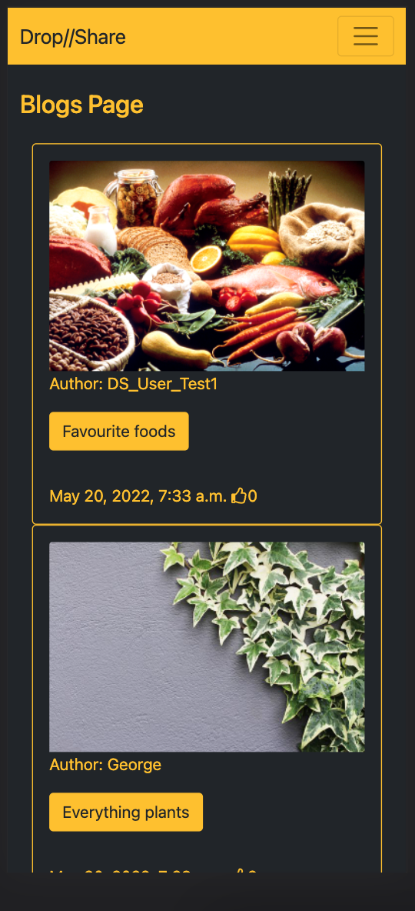
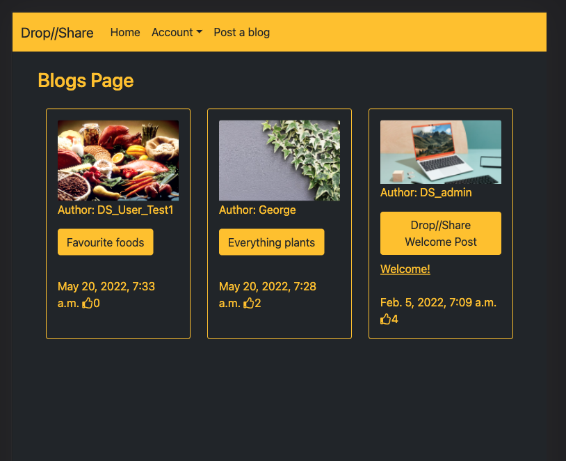

# Drop//Share 

Drop share is a blog website aimed at users who wish to talk about anything and everything or eve specific topics that they feel they want to talk about through a blog post. This will encourage other users to have an input and for conversations to flow and discussions to arise in the blog post.

## User Experience

User experience outlines how the website is layed out from what the user can expect and do and how they can interact with the website. From signing up and making an account to viewing other blog posts. 

1. **User Stories** To make the user interact with the website, user stories are created to help with the process of making the website interactive. Below is a screen shot of git hubs projects which can be set up to target the individual user stories during the build. 
  * User will be able to create an account
  * User will be able to view blog posts
  * User will be able to log in and out of account
  * Once logged in user will be able to create a blog post
  * Admin will be able to monitor blog posts 
  * Admin will be able to approve blog posts
  * User will be able to leave a comment
  * Admin will be able to approve comment
  * User will be able to like and dislike a blog posts

2. **Design**
  * The main aim for the design of this website was to keep it simple using very
   striking colours to make it stand out. The main colours used were orange and black.

  * The main font for this site was Rubik with the back up of sans-serif if the website 
  isnt fully able to load on certain browsers. The main reason for this choice was it looks 
  clean and concise.

  * The placeholder image used is a design of a laptop so that if a user does not chose an image, in their blog post it will default to this picture.

## Features

This section outlines the various features of the website, from the main page to creating a blog and then the individual blog posts. Supported with a number of screenshots

* Here is the main home page view.

* Below are some screenshots of the signing in and our of user accounts and also what to expect wheen you first sign up.

* The first screenshot is what an authorised user will see when they are logged in to post a blog. The second screenshot shows the post a blog page if no user is signed in, asking to either sign up for an account or to login if you are an existing user.

* Below are some site feedback when a user makes a request or submits a form. The sign will redirect the user to the home page or the top of the page with a message to tell them what has just happened.

## Technologies Used

1. Languages used: 
  * HTML5
  * CSS3
  * Python 
  * DJango

2. Frameworks, Libraries and Programs Used:
  * [Bootstrap](https://getbootstrap.com/) - is a framework which enables to manipulate and edit templates.
  * [Google Fonts](https://fonts.google.com/) - is a website that you can import different font styles to your work
  * [Font Awesome](https://fontawesome.com/) - is a stylish icon website which you can import different icons, for this project you would of seen the thumbs up icon.
  * [Cloudinary](https://cloudinary.com/) - is a data storgae website where its easy to store and manage all the different media files that are used on the site.
  * [Git Hub](https://github.com/) - was used as a workspace for the repository for this project, this allows to build and create ideas.
  * [Heroku](https://www.heroku.com/what) - is a cloud based application platform to allow projects to be made into apps.

## Testing

This project was put through individual testing, using various validators, things to note that some imports from the various technologies used a certain Rubik font style was flagged as import error errors in the CSS3 Validator. 

1. Validator Testing
  * [W3C Validator CSS3](https://jigsaw.w3.org/css-validator/validator) - Used to validate CSS code.
  * [PEP8 Validator](http://pep8online.com/) - Used to validate python code, below are some screen shots of the python code being validated with PEP8 validator which flag up no errors when run.
  
  
  
  

2. Screen Testing  - To test if the website is responsive and works on different devices here are some screen shots of the website working on various platforms and browsers
  * Screenshots on various browsers such as chrome and safari
  
  

  * Screenshots on various devices such as a mobile (Pixel 5) and a tablet (Ipad Mini)
  
  

## Deployment and Credits 

**Deployment**

  1. Github is a platform which allows the user to build a website using a repository follow the steps below for account sign up and creating your first repository
      * Go to [GitHub](www.github.com)
      * Find the sign up button top left and fill out the relevent information of setting up your account
      * Once you have created your account you can then start your very first project, you will then be shown your account page and you need to find the green button that says new, it will have a little book icon next to it.
      * Once you have clicked new you will then be asked to give your new project a name.
      * Once you have named your project you can select wether to make your project private or public, you can always change this later.
      * Then you will be redirected to your project page, this will allow you to view all the work you have created, you will see a green button that says create new workspace.
      * When you have clicked that button it will start to load your workspace
      * Then you are ready to begin

  2. Heroku is a cloud based platform to allow you to link your repositories and create your work into apps for you to show your work off.
      * Go to [Heroku](https://www.heroku.com/what)
      * If you havent created an account look for the sign up button.
      * Follow instructions and fill out the required fields to create account.
      * Once your account is created you will be sent to your dashboard page where you can see all your apps or in this case an empty page, click the new button.
      * You will have the option to create a new app or pipeline, in this case click new app, give it a name and the location of where you are currently.
      * When the app is created you will be taken to the main app page, where you will have many option of what you need to do.
      * First you will need to link your github profile and repository, click the deploy tab, once clicked you will be able to see the github logo, once clicked follow the instructions of linking your account and then linking your specific repository.
      * Great your github account is now linked.
      * From here go to your settings tab to connect your config vars and all the secret keys that maybe needed for your deployment.
      * To deploy your app with heroku you will need to link your heroku through your terminal in your Gitpod Workspace. Once there type the following commands:
        * heroku login -i (it will ask the email and password you created on heroku)
        * heroku git:remote -a app-name  (only the first time you connect the app to Heroku in your terminal... skip all other times)
        * git push heroku main (this will push all the changes from the main repo to also the linked heroku page)
      * This will load and give you a run down in the terminal if it was succesful or a failed upload.

**Credit**

1. All images used were either from copyright free websites and screenshots from the local host computer of the work that was done.

2. The Styling for the website was taken from Bootstrap, Google fonts, Font Awesome

3. The site where the [Mockup design] image at the top was from.
