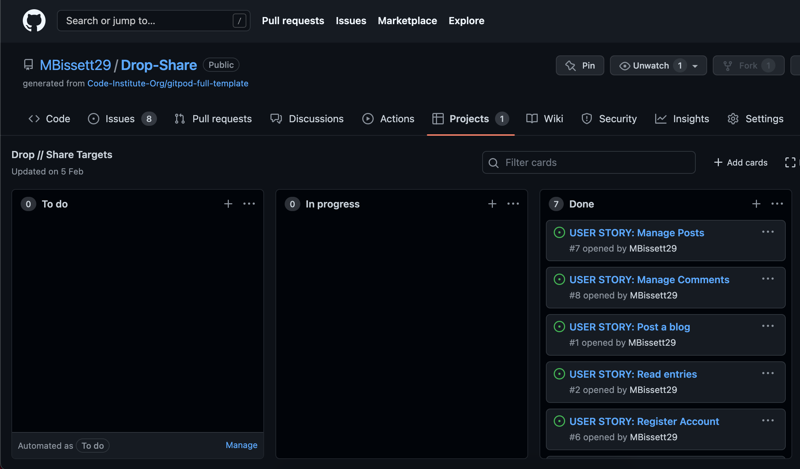
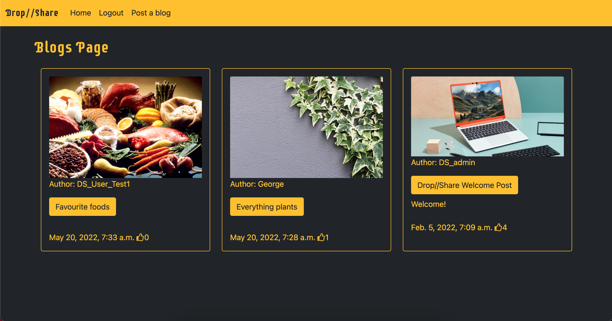
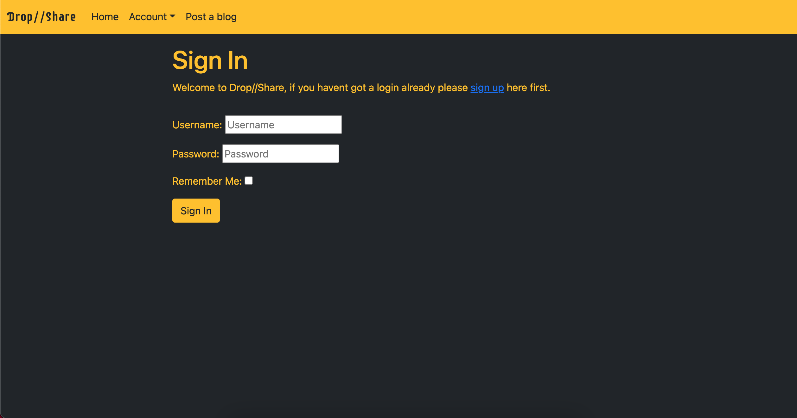
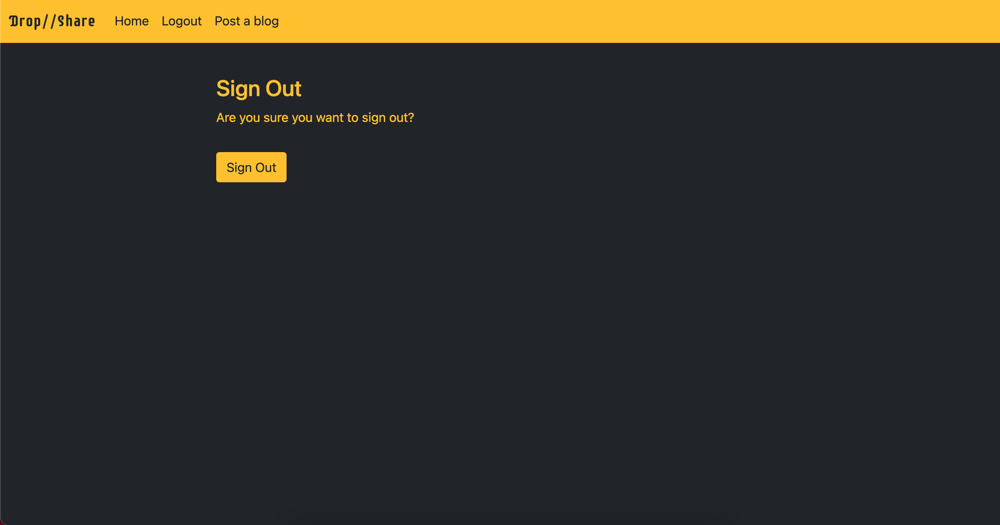
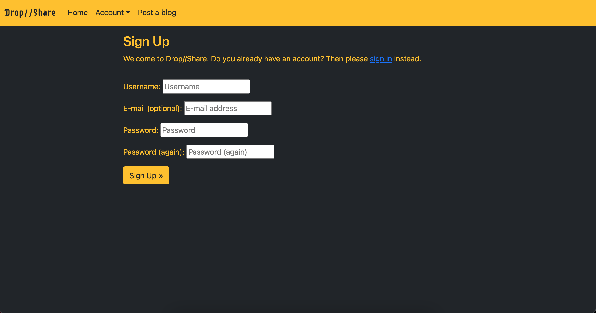
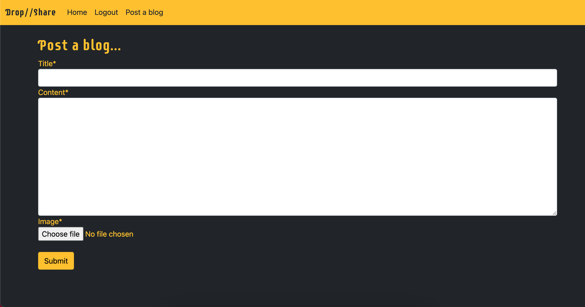
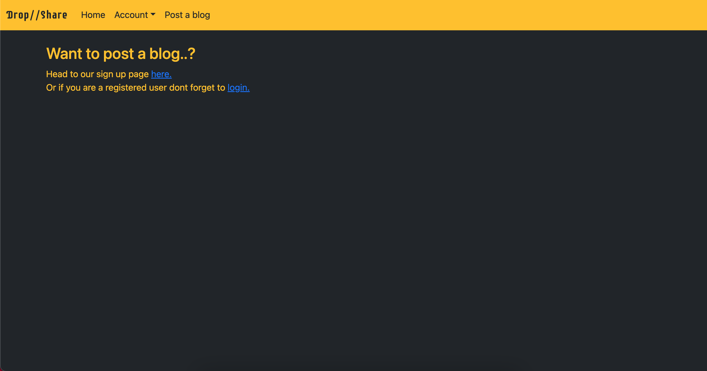
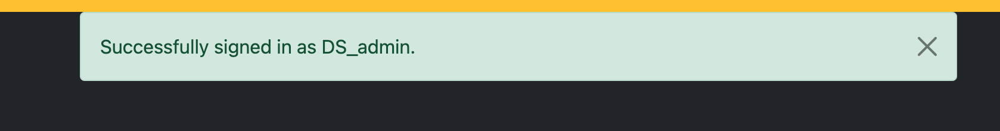
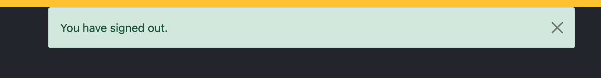
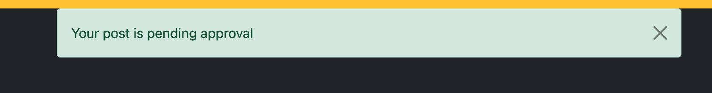

# Drop//Share 

Drop share is a blog website aimed at users who wish to talk about anything and everything or eve specific topics that they feel they want to talk about through a blog post. This will encourage other users to have an input and for conversations to flow and discussions to arise in the blog post.

## User Experience

User experience outlines how the website is layed out from what the user can expect and do and how they can interact with the website. From signing up and making an account to viewing other blog posts. 

1. **User Stories** To make the user interact with the website, user stories are created to help with the process of making the website interactive. Below is a screen shot of git hubs projects which can be set up to target the individual user stories during the build. 
  * User will be able to create an account
  * User will be able to view blog posts
  * User will be able to log in and out of account
  * Once logged in user will be able to create a blog post
  * Admin will be able to monitor blog posts 
  * Admin will be able to approve blog posts
  * User will be able to leave a comment
  * Admin will be able to approve comment
  * User will be able to like and dislike a blog posts

2. **Design**
  * The main aim for the design of this website was to keep it simple using very
   striking colours to make it stand out. The main colours used were orange and black.

  * The main font for this site was Rubik with the back up of sans-serif if the website 
  isnt fully able to load on certain browsers. The main reason for this choice was it looks 
  clean and concise.

  * The placeholder image used is a design of a laptop so that if a user does not chose an image, in their blog post it will default to this picture.

## Features

This section outlines the various features of the website, from the main page to creating a blog and then the individual blog posts. Supported with a number of screenshots

* Here is the main home page view.

* Below are some screenshots of the signing in and our of user accounts and also what to expect wheen you first sign up.

* The first screenshot is what an authorised user will see when they are logged in to post a blog. The second screenshot shows the post a blog page if no user is signed in, asking to either sign up for an account or to login if you are an existing user.

* Below are some site feedback when a user makes a request or submits a form. The sign will redirect the user to the home page or the top of the page with a message to tell them what has just happened.

## Technologies Used

1. Languages used: 
  * HTML5
  * CSS3
  * Python 
  * DJango

2. Frameworks, Libraries and Programs Used:
  * [Bootstrap](https://getbootstrap.com/) - is a framework which enables to manipulate and edit templates.
  * [Google Fonts](https://fonts.google.com/) - is a website that you can import different font styles to your work
  * [Font Awesome](https://fontawesome.com/) - is a stylish icon website which you can import different icons, for this project you would of seen the thumbs up icon.
  * [Cloudinary](https://cloudinary.com/) - is a data storgae website where its easy to store and manage all the different media files that are used on the site.
  * [Git Hub](https://github.com/) - was used as a workspace for the repository for this project, this allows to build and create ideas.
  * [Heroku](https://www.heroku.com/what) - is a cloud based application platform to allow projects to be made into apps.

## Testiong

1. Validator Testing
  * W3c Validator 
  * Jigsaw Validator
  * PEP8 Validator

2. Screen Testing 
  * Screenshots on various browsers
  * Screenshots on various devices

## Deployment and Credits 

1. Deployment
  * Github

2. Heroku
  * Account Creation
  * Link Github repo to heroku app